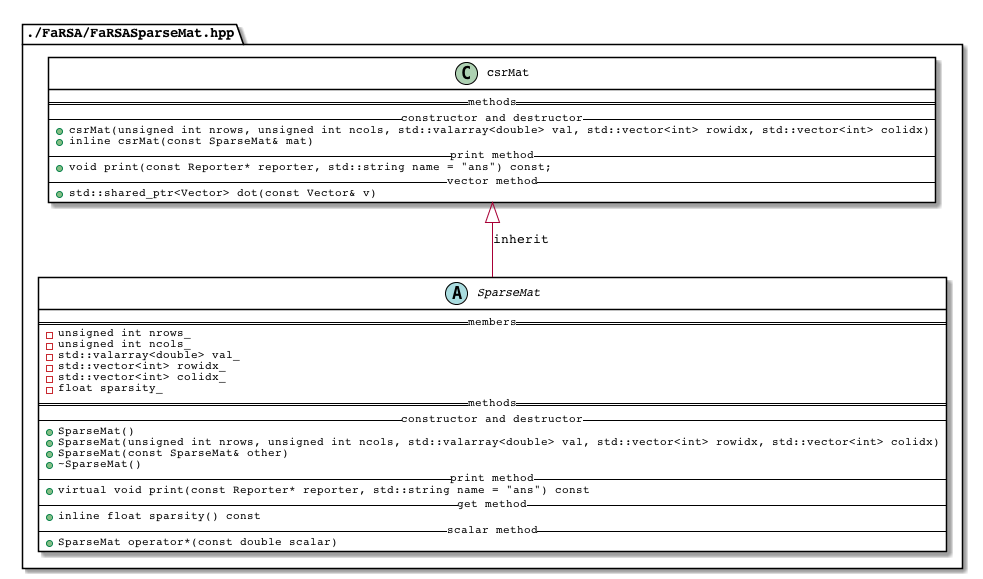

# Sparse Matrix representation

1. compressed sparse row (CSR)
2. compressed sparse column (CSC)
3. Coordinate list (COO)

And [more](https://en.wikipedia.org/wiki/Sparse_matrix#Compressed_sparse_column_(CSC_or_CCS))...

## compressed sparse row

 This format allows 
 1. fast row access and,
 2. matrix-vector multiplications.

*Toy example*

The representation of  the following matrix 
$$
M=
\begin{pmatrix}
0 & 0 & 0 & 0\\
0 & 5 & 0 & 8\\
3 & 0 & 0 & 0\\
0 & 0 & 6 & 0
\end{pmatrix}
$$

is 

```
val = [5, 8, 3, 6] 
col_idx = [1, 3, 0, 2]
row_idx = [0, 0, 2, 3, 4].
```

The `row_idx` is built recursively. Assume the 0-index rule, then the first element of `row_idx`, i.e. `row_idx[0]`, is always set to 0 and 

```
row_idx[i] = (# nonzero elements in row i-1) + row_idx[i-1]   for i>=1.
```

*How to get elements from CSR representation*:

It's easy to get elements by row. For example, we want to get the elements in the 0-th row (the first row in M)

```
row_start = row_idx[0] = 0
row_end = row_idx[0+1] = 0
```
Since `row_start` is equal to `row_end`, we know the elements in 0-th row are all zeros.

Another example, we want to get the elements in the 1-th row (the second row in M)

```
row_start = row_idx[1] = 0
row_end = row_idx[1+1] = 2
```
In this case, we know the 1-th row contains nonzero elements and their column indices and values are

```
col_idx[0:2]    # {1, 3}
val[0:2]        # {5, 8},
```

which means

```
M[1,1] = 5
M[1,3] = 8
```

# Setup Github

* Fork from `daniel-p-robinson/FaRSAR` refer it as `upstream`. Your copy at your github in called `origin`

```
# git remote -v
origin	https://github.com/Rothdyt/FaRSA.git (fetch)
origin	https://github.com/Rothdyt/FaRSA.git (push)
upstream	https://github.com/daniel-p-robinson/FaRSA.git (fetch)
upstream	https://github.com/daniel-p-robinson/FaRSA.git (push)
```

The purpose of this you can keep `origin` up-to-date with `upstream`.

* Clone `orgin` to  your local computer. It will create a branch named `master`. And then mannually create a working branch named `yutong` and swtich to this branch as a place you play around.

```
  master
* yutong
```

The purpose of this you can keep `master` up-to-date with `origin` without  interfering your working branch, which can be a few commits ahead of the `upstream` and  a few commits behind of the `upstream`.


* Sync your working brach with `orgin`

```
git push origin yutong
git pull origin yutong
```

* Sync your `master` with `orgin`


# C++ Implementation




# Questions

* Should I use `std::valarray<double>`  as the container for `val_`. 
  * Would envison my `val_` is not only a vector of `double` but also a vector of any `numerics` and `bool`. Should I use template